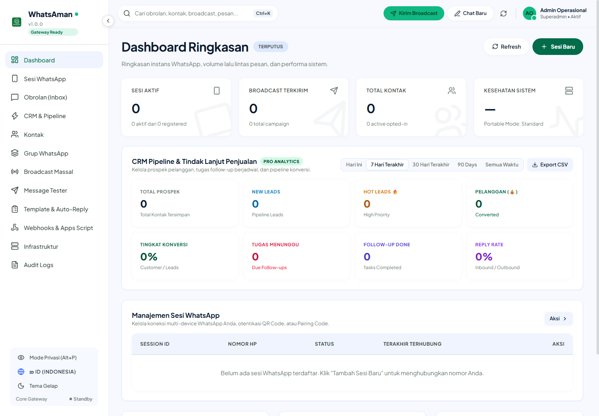
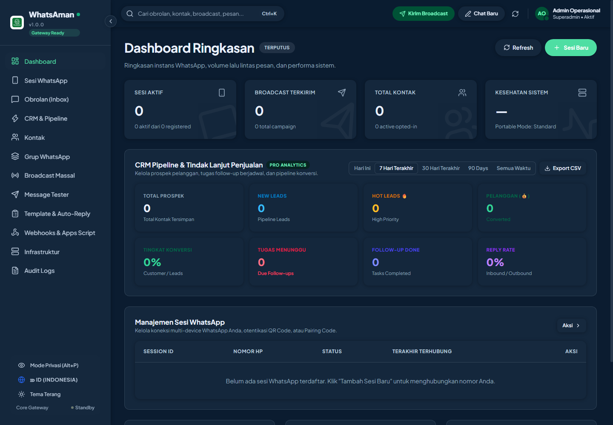

# 🟢 WhatsAman (WhatsApp Automation & CRM Suite)
### *by Aman Kerja Studio*

[](https://github.com/WhiskeySockets/Baileys)
[](https://nodejs.org)
[](https://tauri.app)
[-003B57?style=flat-square&logo=sqlite)](https://sqlite.org)
[](LICENSE)

> **Platform Terpadu Otomatisasi WhatsApp Multi-Akun, Broadcast Engine Cerdas, & Mini CRM Sales Pipeline.**  
> Menggabungkan ketangguhan **Aman Gateway (Pure WebSocket Protocol)**, **REST API & Webhooks standar industri**, serta **Mini CRM Pipeline** dalam satu aplikasi desktop mandiri yang **100% Portabel di Windows** tanpa biaya langganan bulanan.

---

## 📸 Antarmuka Aplikasi (Preview)

| Light Modern Dashboard | Sleek Dark Mode & Live Chat |
| :---: | :---: |
|  |  |

---

## 💡 Mengapa WhatsAman Berbeda?

| Fitur / Karakteristik | Software Blast Biasa | Layanan Cloud API Pihak Ke-3 | **WhatsAman (Aman Kerja Studio)** |
| :--- | :--- | :--- | :--- |
| **Biaya Operasional** | Rp150rb – Rp500rb/bulan | Rp500rb – Rp2jt/bulan + biaya per chat | **Sekali Beli, Pakai Selamanya (Rp 0/bulan)** |
| **Konsumsi RAM** | Boros (800MB–1.5GB / nomor) | Ringan (tetapi server cloud luar) | **Super Ringan (~40–70 MB per nomor)** |
| **Teknologi Mesin** | Headless Chrome (Puppeteer) | Cloud SaaS tertutup | **Aman Gateway (Pure WebSocket Socket)** |
| **Privasi Data** | Kredensial di laptop rawan bocor | Database kontak tersimpan di server pihak ke-3 | **100% Mandiri di SQLite Lokal Anda** |
| **Metode Login** | Hanya Scan QR Code | WABA Verifikasi Meta yang rumit | **Dual Mode: Scan QR + 8-Digit Pairing Code** |
| **CRM & Sales Funnel** | Tidak ada (hanya blast kaku) | Terpisah / harus langganan CRM lain | **Built-in Visual Kanban CRM & Scheduler** |
| **Setup & Dependensi** | Wajib install Chrome/Node manual | Perlu setting DNS & Server Cloud | **1-Klik Langsung Jalan (Windows Portable)** |

---

## 🌟 12 Modul Fitur Unggulan

### 1. ⚡ Aman Gateway Multi-Device Engine
* **Pure WebSocket Protocol**: Bekerja langsung melalui socket protokol WhatsApp Web tanpa membuka browser tersembunyi (Chromium/Puppeteer).
* **Dual Login Mode**:
  1. **Scan QR Code**: Pindai QR Code dari kamera smartphone Anda seperti biasa.
  2. **8-Digit Pairing Code**: Masukkan nomor telepon dan dapatkan kode 8 digit langsung di notifikasi WhatsApp ponsel (solusi saat kamera ponsel bermasalah).
* **Auto-Reconnect & Multi-Device Isolation**: Setiap sesi WhatsApp memiliki direktori autentikasi mandiri (`data/sessions/<id>/auth/`) dengan mekanisme pemulihan koneksi otomatis.

### 2. 💬 Live Unified Inbox & Privacy Mode
* **Chat Terpusat**: Baca pesan masuk dan balas langsung dari aplikasi secara real-time.
* **Filter Chat Fleksibel**: Saring obrolan berdasarkan *Semua*, *Personal*, *Grup*, *Saluran*, atau *Belum Dibaca*.
* **Privacy Mode (`Alt + P`)**: Seketika mengaburkan (*blur*) nomor telepon, nama pelanggan, dan pesan di layar saat Anda bekerja di ruang publik atau sedang share screen di Zoom.
* **Customer Notes**: Tulis catatan khusus pelanggan langsung di bilah samping obrolan.

### 3. 🎯 Mini CRM & Sales Funnel Pipeline
* **Kanban Funnel Visual**: Kategorikan setiap calon pembeli ke tahapan alur penjualan:
  * 🟡 **Lead**: Kontak baru yang baru bertanya.
  * 🔵 **Prospect**: Kontak berminat yang sedang konsultasi atau meminta daftar harga.
  * 🟢 **Customer**: Pelanggan yang telah berhasil closing / bertransaksi.
  * 🔴 **Churned**: Kontak yang belum berminat atau batal membeli.
* **Follow-Up Scheduler**: Jadwalkan tanggal dan jam tindak lanjut dengan draf pesan otomatis.
* **Deal Value & Ringkasan Penjualan**: Catat estimasi nilai closing per pelanggan untuk menghitung total potensi omzet pipeline.

### 4. 🚀 Broadcast Massal Cerdas (Anti-Ban Engine)
* **Spintax Dinamis**: Variasikan kata secara acak otomatis di setiap pesan, misalnya `{Halo|Hai|Selamat pagi} Kak {{name}}`. Sensor WhatsApp akan mendeteksi setiap pesan sebagai pesan unik!
* **Random Delay (Jeda Acak)**: Tetapkan rentang jeda antar pesan (misal 5–15 detik) untuk mensimulasikan pengetikan manual manusia normal.
* **Batch Pause Automation**: Istirahatkan pengiriman pesan secara otomatis setiap X pesan (contoh: jeda 60 detik setiap 50 pesan terkirim) guna menjaga reputasi nomor.
* **Kontrol Fleksibel**: Jeda (*pause*), lanjutkan (*resume*), atau batalkan (*stop*) pengiriman broadcast kapan saja.

### 5. 👥 Group Grabber (1-Klik Ekspor Kontak)
* Ekstrak seluruh nomor anggota dari grup WhatsApp mana pun yang Anda ikuti langsung ke file **Excel (.xlsx)**.
* **Tanpa Perlu Jadi Admin Grup**: Bekerja pada seluruh grup publik maupun komunitas yang Anda ikuti.
* Nomor otomatis dibersihkan dan distandarisasi ke format internasional (`+62` / `62`).

### 6. 🗃️ Manajemen Kontak & Sinkronisasi Massal
* **1-Klik Sync WhatsApp**: Tarik seluruh kontak dari buku telepon ponsel dan riwayat chat ke database lokal.
* **Import & Export Excel (.xlsx)**: Kelola ribuan database prospek dari spreadsheet luar dengan mudah.
* **Tagging Kustom**: Beri label kategori seperti `#VIPBuyer`, `#ResellerJatim`, `#EventAgustus`.

### 7. 🤖 Smart Chatbot & Auto-Responder
* **Logika Pemicu Lengkap**: Mengandung kata (*contains*), sama persis (*equals*), diawali kata (*starts_with*), hingga pola ekspresi reguler (*regex*).
* **Multi-Action Automation**: Balasan otomatis dapat sekaligus menyematkan tag atau memindahkan stage prospek di pipeline CRM secara otomatis!
* **Business Hours (Jam Operasional)**: Atur jam aktif bot untuk memberi tahu pelanggan saat kantor sedang tutup.

### 8. 🔗 Webhooks & Form Integrator
* **Google Forms Integration**: Kirim notifikasi WhatsApp otomatis saat ada formulir Google Form yang diisi (lengkap dengan template script Google Apps Script siap pakai).
* **Dukungan Toko Online & Website**:
  * WooCommerce (Notifikasi order baru, pesanan dikirim, pembayaran lunas)
  * Elementor Forms & Contact Form 7 (CF7)
  * Zapier, Make.com, n8n, dan Custom Outgoing Webhooks.

### 9. 📡 Interactive Swagger REST API
* REST API terstandarisasi untuk menghubungkan WhatsAman ke aplikasi web, sistem POS, ERP, atau software kasir Anda.
* Dokumentasi visual OpenAPI Swagger di `http://localhost:3000/docs`.
* Endpoint lengkap: kirim pesan teks, kirim gambar/dokumen/audio, cek status koneksi, ekspor kontak, dan trigger broadcast.

### 10. 🧪 Message Tester & API Simulator
* Uji coba pengiriman pesan teks, template spintax, serta berkas lampiran sebelum memulai kampanye besar.
* **Live Telemetry & JSON Response Inspector**: Menampilkan status HTTP, payload respon, dan latensi socket gateway secara real-time.
* **Code Snippet Generator**: Salin kode integrasi instan untuk `cURL`, `Node.js (Axios)`, `PHP (cURL/Http)`, dan `Python (requests)`.

### 11. 🛡️ Infrastruktur Portabel & Enkripsi Cadangan
* **Zero External DB**: Menggunakan database embedded **SQLite 3** dengan mode **WAL (Write-Ahead Logging)** yang super cepat dan tahan *crash*.
* **100% Portabel**: Seluruh database, media, dan kredensial tersimpan dalam folder `data/`. Pindahkan folder ke drive lain atau flashdisk tanpa kehilangan data.
* **1-Klik Backup & Restore**: Amankan database Anda dalam format snapshot terenkripsi AES-256.

### 12. 🎨 UI/UX Modern & Bilingual
* Mengikuti pedoman desain minimalis, data-dense, flat, dan bersih.
* **Dual Theme**: Tersedia mode *Light Modern* dan *Sleek Slate Dark Mode*.
* **Bilingual Switcher**: Beralih antara Bahasa Indonesia dan Bahasa Inggris dalam 1 klik.

---

## 📁 Struktur Direktori Proyek

```
WHATSAPP ULTRA TOOL APLIKASI V1/
├── WhatsAppLocalHub.bat       <-- Eksekusi 1-klik di Windows (Auto browser)
├── WhatsAppLocalHub.exe       <-- Native Desktop App (Tauri / WebView2)
├── ARCHITECTURE.md            <-- Dokumentasi Arsitektur Teknis
├── README.md                  <-- Dokumentasi Utama Proyek
├── MARKETING_KIT/             <-- Materi Pemasaran, Sales Pitch, Copywriting & Screenshots
│   ├── 00_DAFTAR_ISI_DAN_PANDUAN.md
│   ├── 01_RANGKUMAN_EKSEKUTIF_PRODUK.md
│   ├── 02_KATALOG_FITUR_LENGKAP.md
│   ├── 03_COPYWRITING_IKLAN_DAN_PROMOSI.md
│   ├── 04_PANDUAN_DEMO_DAN_SALES_PITCH.md
│   └── screenshots/          <-- Screenshot HD antarmuka aplikasi
├── config/
│   └── default.json           <-- Port HTTP (3000) & konfigurasi server
├── data/                      <-- Direktori Data Portabel (Disertakan saat backup)
│   ├── database.sqlite        <-- Database SQLite (Sesi, Kontak, Chat, CRM, Campaign)
│   ├── sessions/              <-- Kredensial Multi-Device Aman Gateway per Sesi
│   ├── media/                 <-- Berkas media yang diunggah
│   └── backups/               <-- File cadangan database
├── src/                       <-- Source Code Backend (TypeScript)
│   ├── api/                   <-- Express Routes, Controllers, Swagger, Webhook
│   └── core/
│       ├── engine/            <-- Aman Gateway Socket Adapter & Session Manager
│       ├── database/          <-- SQLite Repositories & Database Migration
│       ├── events/            <-- Event Bus & Event Types
│       └── services/          <-- Message, Campaign, Contact, CRM, Auto-Reply Services
├── src-tauri/                 <-- Konfigurasi & Source Code Aplikasi Desktop Native (Rust/Tauri)
└── ui/                        <-- Source Code Frontend (React + Vite + Tailwind CSS)
    ├── src/
    │   ├── panels/            <-- Sessions, Chats, CRM, Campaigns, Contacts, Tester, dll
    │   ├── components/        <-- UI Reusable Components
    │   └── i18n.ts            <-- Terjemahan Bilingual (ID & EN)
    └── package.json
```

---

## 🖥️ Cara Menjalankan Aplikasi

### Mode 1 — Portabel Windows (Paling Mudah untuk Pengguna):
1. Buka folder aplikasi di Windows Explorer.
2. Klik ganda file:
   ```cmd
   WhatsAppLocalHub.bat
   ```
3. Server dan database akan aktif otomatis, lalu browser Anda akan langsung membuka:
   ```
   http://127.0.0.1:3000
   ```

### Mode 2 — Native Desktop App (Tauri):
Untuk menjalankan antarmuka desktop native Windows:
```bash
npm run dev:tauri
```

### Mode 3 — Mode Pengembang (Developer):
```bash
# 1. Install seluruh dependensi
npm install
cd ui && npm install && cd ..

# 2. Jalankan Backend Server
npm run dev

# 3. Jalankan Frontend Vite UI
npm run ui:dev

# 4. Bangun untuk Production
npm run build
npm run ui:build
```

---

## 📡 Referensi REST API & Swagger UI

Ketika aplikasi aktif, Anda dapat membuka Swagger UI interaktif di:  
👉 **[http://localhost:3000/docs](http://localhost:3000/docs)**

Beberapa endpoint esensial:
* **Status Gateway & Telemetri**: `GET /api/v1/system/status`
* **Daftar Sesi Aktif**: `GET /api/v1/sessions`
* **Inisialisasi Sesi Baru**: `POST /api/v1/sessions` (body: `{"id": "cs-utama", "name": "CS 1"}`)
* **Ambil QR Code / Pairing Code**: `GET /api/v1/sessions/:id/qr` & `POST /api/v1/sessions/:id/pairing-code`
* **Kirim Pesan Teks**: `POST /api/v1/messages/text` (body: `{"sessionId": "...", "to": "628...", "text": "..."}`)
* **Kirim Media (Gambar/PDF)**: `POST /api/v1/messages/media`
* **CRM Pipeline Contacts**: `GET /api/v1/crm/contacts` & `PATCH /api/v1/crm/contacts/:id/stage`
* **Ekspor Kontak Grup**: `GET /api/v1/groups/:jid/export?sessionId=...`

---

## 🔒 Keamanan & Isolasi Data

1. **Privasi 100% Milik Pengguna**: Seluruh kredensial token sesi WhatsApp, isi percakapan, database pelanggan, dan data CRM disimpan secara lokal di mesin komputer Anda dalam file `database.sqlite` dan folder `sessions/`.
2. **Tanpa Pengiriman Data ke Cloud Eksternal**: Aplikasi ini tidak mengirimkan salinan obrolan atau nomor kontak Anda ke pihak ketiga mana pun.
3. **Decoupled Architecture**: Logika bisnis (CRM, Campaign, Auto-reply) terpisah dari protokol transport melalui antarmuka `IWhatsAppEngine`. Jika terjadi update dari protokol WhatsApp Web, pembaruan engine dapat diterapkan secara transparan tanpa merusak database Anda.

---

## 👥 Tim & Lisensi

* **Pengembang**: Aman Kerja Studio
* **Teknologi**: Node.js, TypeScript, Aman Gateway, SQLite 3, React, Tailwind CSS, Tauri.
* **Dukungan & Pertanyaan**: Silakan merujuk ke berkas di dalam folder `MARKETING_KIT/` untuk panduan penjualan dan integrasi teknis lebih lanjut.
